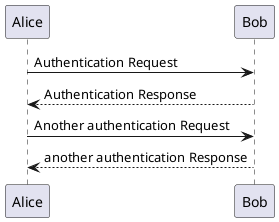

# Headline

> An awesome project.

你好

<!-- tabs:start -->

#### **English**

Hello!

#### **French**

Bonjour!

#### **Italian**

Ciao!

<!-- tabs:end -->

[docsify-tabs - 一个docsify.js插件，用于从 markdown 渲染选项卡式内容 (jhildenbiddle.github.io)](https://jhildenbiddle.github.io/docsify-tabs/#/)

[fzankl/docsify-plugin-flexible-alerts：docsify 插件使用预配置或自己的样式和警报类型将块引用转换为美观且可配置的警报。 (github.com)](https://github.com/fzankl/docsify-plugin-flexible-alerts?tab=readme-ov-file)

[erickjx/docsify-fontawesome：Docsify 的 FontAwesome 插件 (github.com)](https://github.com/erickjx/docsify-fontawesome)

[TheGreenToaster/docsify-glossary：Docsify 的简单词汇表 (github.com)](https://github.com/TheGreenToaster/docsify-glossary)

### Section X

