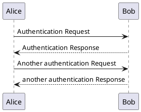

# 开始

> 个人笔记本
>
> 所作笔记为方便 我本人复习使用，以我的视角所编写，尽量通俗易懂，不一定适合所有人查看，如果看着混乱请见谅。
>


## 联系我

文档如有问题请联系我

>:fab fa-qq: ：  <a href="http://wpa.qq.com/msgrd?v=3&uin=1244118445&site=qq&menu=yes">1244118445</a>
>
>:fas fa-envelope: : <a href="mailto:1244118445@qq.com">1244118445@qq.com</a>

## 目录


## 插件使用备忘录

```yaml
//运行
docsify serve docs

```


### 关于插件的使用方法


#### 1. tabs切换框

<!--  tabs:start -->

#### **显示效果**

<!-- tabs:start -->

#### **English**

Hello!

#### **French**

Bonjour!

#### **Italian**

Ciao!

<!-- tabs:end -->

#### **源码**


```html
<!-- tabs:start -->

#### **English**

Hello!

#### **French**

Bonjour!

#### **Italian**

Ciao!

<!-- tabs:end -->


```

<!--  tabs:end -->


> 详情[docsify-tabs - A docsify.js plugin for rendering tabbed content from markdown (jhildenbiddle.github.io)](https://jhildenbiddle.github.io/docsify-tabs/#/)
>
> 链接中还记载着一些更有趣的效果，请自行查看


#### 2. emoji表情插入

支持emoji表情插入

例如

<!--  tabs:start  -->

#### **效果**

:smile:

#### **源码**

`:smile:`

<!--  tabs:end  -->

> 具体样式克查询[markdown表情大全-CSDN博客](https://blog.csdn.net/qq_40896997/article/details/106551767)


#### 3.fontAwesome icon 插件引入

支持快速icon显示，插件会自动把`:fa fa-home fa-fw:`生成`<i class="fa fa-home fa-fw"></i>`

例如：

<!--  tabs:start  -->

#### **效果**

:fa fa-home fa-fw:

#### **源码**

`:fa fa-home fa-fw:`

<!--  tabs:end  -->


#### 4. 不同样式的提示框

> 项目地址：[fzankl/docsify-plugin-flexible-alerts：docsify 插件使用预配置或自己的样式和警报类型将块引用转换为美观且可配置的警报。 (github.com)](https://github.com/fzankl/docsify-plugin-flexible-alerts?tab=readme-ov-file)

本人插件配置是

```
'flexible-alerts': {
      style:'callout', //flat   有两个风格可选，一个是空心透明   ，一个是填充颜色
      //以及四个默认类型
      note: {
        label: "Hinweis"
      },
      tip: {
        label: "Tipp"
      },
      warning: {
        label: "Warnung"
      },
      attention: {
        label: "Achtung"
      }
    },
```

以下是基础写法：

<!--  tabs:start  -->

#### **效果**

> [!NOTE]
> An alert of type 'note' using global style 'callout'.

#### **源码**

```yaml
> [!NOTE]
> An alert of type 'note' using global style 'callout'.
```

<!--  tabs:end  -->

插件提供自定义自定义默认配置，在配置栏新加入你所想显示 的内容，可选参数

| key             | value                                |
| --------------- | ------------------------------------ |
| label           | 显示的文本                           |
| icon            | 图标的 class 例如 'fas fa-comment'   |
| className       | css现实的类class名                   |

例如

```
comment: {
        label: 'Comment',
        icon: 'fas fa-comment',
        className: 'note'
      }
```

现在我们测试一下效果


<!--  tabs:start  -->

#### **效果**

> [!comment]
> 这是我们自定义的效果显示

#### **源码**

```yaml
> [!comment]
> 这是我们自定义的效果显示
```

<!--  tabs:end  -->


也可以不按照默认配置，在写文档的时候灵活运用，以下是自定义内容

| key             | value                                |
| --------------- | ------------------------------------ |
| style           | callout、 flat  （二选一）           |
| label           | 显示的文本                           |
| icon            | 图标的 class 例如 'fas fa-comment'   |
| className       | css现实的类class名                   |
| labelVisibility | 显示文本与否: visible (默认), hidden |
| iconVisibility  | 显示图标与否: visible (默认), hidden |

我们来几个例子领会一下吧

<!--  tabs:start  -->

#### **原效果**

> [!TIP]
>  这是原来效果.

#### **源码**

```yaml
> [!TIP]
> 这是原来效果.
```

<!--  tabs:end  -->

<!--  tabs:start  -->

#### **效果1**

> [!TIP|style:flat|label:提示|iconVisibility:hidden]
>  tip修改风格，且更换文本提示，不显示图标

#### **源码**

```yaml
> [!TIP|style:flat|label:提示|iconVisibility:hidden]
> tip修改风格，且更换文本提示，不显示图标
```

<!--  tabs:end  -->

<!--  tabs:start  -->

#### **效果2 修改图标  不显示文本**

> [!TIP|style:flat|icon:fa fa-home fa-fw|label:My own heading|labelVisibility:hidden]
>  修改图标，不显示文本

#### **源码**

```yaml
> [!TIP|style:flat|icon:fa fa-home fa-fw|label:My own heading|labelVisibility:hidden]
> 修改图标，不显示文本
```

<!--  tabs:end  -->


#### 5. UML 插件

引入的是plantuml

<!--  tabs:start  -->

#### **时序图效果**



#### **源码**

```
@startuml
Alice -> Bob: Authentication Request
Bob --> Alice: Authentication Response

Alice -> Bob: Another authentication Request
Alice <-- Bob: another authentication Response
@enduml
```

<!--  tabs:end  -->

>  具体参考[一小时实践入门 PlantUML - 知乎 (zhihu.com)](https://zhuanlan.zhihu.com/p/644357678)   以后再补充
